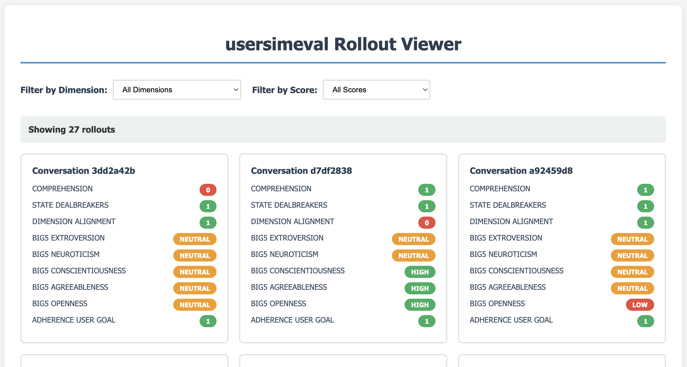

<h2 align="center">SalesSim</h2>
<p align="center">
  <a href="https://personafollowing.github.io/">Release Blog</a>
</p>

<p align="center">
  SalesSim is an environment for simulating interactions between AI customers and e-commerce sales agents.
</p>

<p align="left" ><b>Features</b><br>
- An evaluation environment for model ability to act as a salesperson, with an initial setting of laptop e-commerce sales.<br>
- Eight human-validated graders for user simulator realism for AI customers.<br>
- Evaluation and error analysis tool for AI customer realism.
</p>

## Installation

```bash
python3 -m pip install --user pipx
python3 -m pipx ensurepath
pipx install -e .
pip install -e .
```

## Usage

<p align="center">

```bash
python3 salessim/simulate.py  --save {OUTPUT_SIMULATIONS_DIR} --config {RUN_CONFIG}
python3 salessim/evaluate.py {OUTPUT_SIMULATIONS_DIR} 
```
To see what the config expects, refer to <code>example_run_config.yaml</code>.
</p>
We use LiteLLM to support various model providers, as well as self-hosted model evaluations.

To evaluate an open-weight model, we recommend using vLLM. Please run with tool parsing enabled. We also support reasoning models in this evaluation environment.
```bash
vllm serve /path/to/ckpt/mistral-3.1-small/  --tokenizer_mode mistral --config_format mistral --load_format mistral   --tensor-parallel-size 2 --gpu-memory-utilization 0.9 --max-model-len 8192 --served-model-name mistral-small --enable-auto-tool-choice --tool-call-parser mistral

vllm serve Qwen/Qwen3-8B --tensor-parallel-size 2 --gpu-memory-utilization 0.4 --reasoning-parser qwen3 --served-model-name qwen-8b --port 8001 --enable-auto-tool-choice --tool-call-parser hermes
```


## Customer Simulator Evaluation

<p align="center">

```bash
usersimeval -h # List CLI functionality.
usersimeval run --input_file {OUTPUT_SIMULATIONS_DIR} --output_dir {OUTPUT_EVALS_DIR} --dimensions ALL
usersimeval viz --base-dir usersimeval/mistral_sample_output --port 8004
```
</p>


<code>usersimeval viz</code> allows for drilling down to individual conversations. 

<p align="left">
  
</p>

